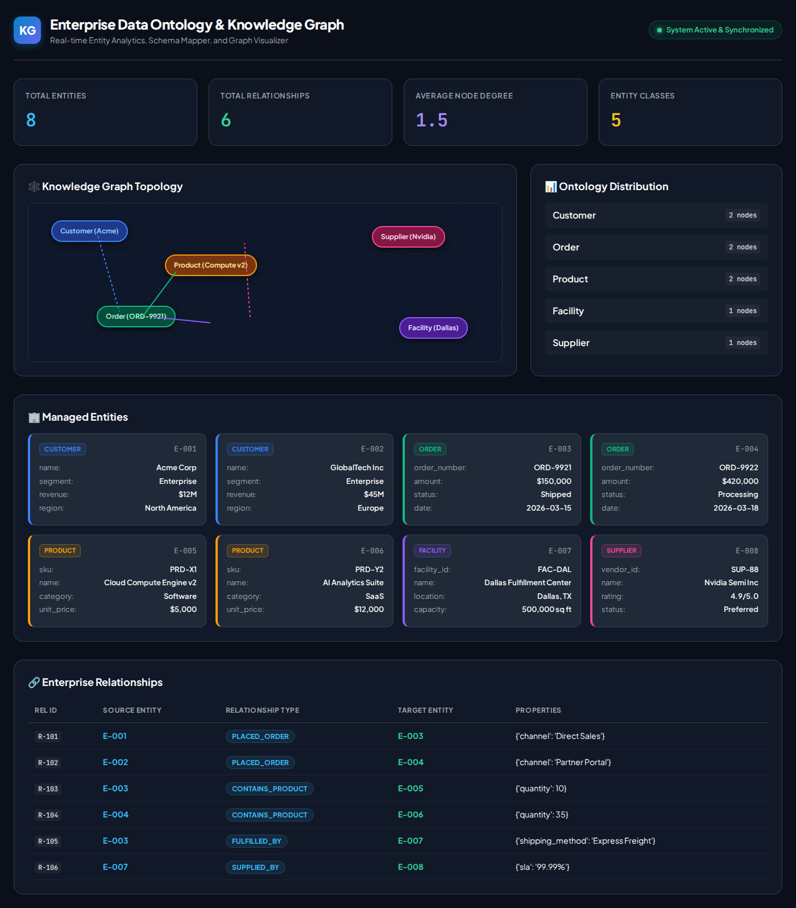

# Enterprise Data Ontology Knowledge Graph

A comprehensive enterprise data ontology and knowledge graph system for managing complex business data structures and relationships, complete with an interactive REST API and a real-time visual web dashboard.



## Project Overview

This project provides a flexible and scalable framework for:
- **Enterprise Ontology Definition**: Modular structures for defining entities, relationships, attributes, and canonical vocabularies.
- **Knowledge Graph Management**: Graph node/edge management, degree analytics, and neighborhood traversal routines.
- **Interactive Web Dashboard**: Built-in visual dashboard for entity exploration, relationship mapping, graph metrics, and distribution breakdown.
- **RESTful API**: Comprehensive FastAPI service for programmatic CRUD operations and real-time graph queries.
- **Comprehensive Testing**: Complete unit and integration test coverage with `pytest`.

---

## Features

- 🏗️ **Modular Architecture**: Clear separation of ontology builder, graph manager, validators, and REST API layers.
- 🔗 **Entities & Relationships**: Complete lifecycle management (Create, Read, Update, Delete, Filter).
- 📊 **Real-time Metrics**: Compute degree distribution, node counts, relationship statistics, and graph topology.
- 🌐 **RESTful API**: Programmatic HTTP API with standard JSON request/response formats.
- 🖥️ **Visual Dashboard**: Modern web UI served directly at `/dashboard` displaying live graph state and statistics.
- 🧪 **High Quality & Test Coverage**: Fully verified with unit and integration tests using `pytest`.

---

## Quick Start

### Installation

```bash
# Clone the repository
git clone <repository-url>
cd Enterprise-Data-Ontology-Knowledge-Graph

# Install Python dependencies
pip install -r requirements.txt
```

### Running the API & Dashboard

```bash
python -m uvicorn src.api.app:app --reload
```

- **Interactive Dashboard**: Navigate to `http://localhost:8000/dashboard` or `http://localhost:8000/`
- **Swagger UI Documentation**: `http://localhost:8000/docs`
- **ReDoc API Docs**: `http://localhost:8000/redoc`

---

## API Summary

### System & Metrics
- `GET /health` - API Health check
- `GET /api/v1/stats` - Graph summary statistics & metrics

### Dashboard
- `GET /dashboard` or `GET /` - Interactive visual HTML dashboard

### Entities (`/api/v1/entities`)
- `GET /api/v1/entities` - List entities (optional `?type=` filter)
- `POST /api/v1/entities` - Create entity
- `GET /api/v1/entities/{id}` - Get entity details & connected neighbors
- `PUT /api/v1/entities/{id}` - Update entity properties/type
- `DELETE /api/v1/entities/{id}` - Delete entity and cascade relationships

### Relationships (`/api/v1/relationships`)
- `GET /api/v1/relationships` - List relationships (optional `?type=`, `?source=`, `?target=` filters)
- `POST /api/v1/relationships` - Create relationship
- `GET /api/v1/relationships/{id}` - Get relationship details
- `DELETE /api/v1/relationships/{id}` - Delete relationship

---

## Testing

Run all unit and integration tests:

```bash
pytest
```

---

## License

MIT License. See LICENSE file for details.
